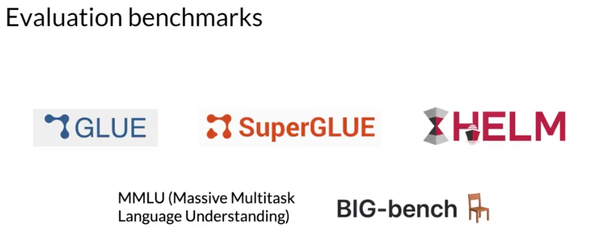
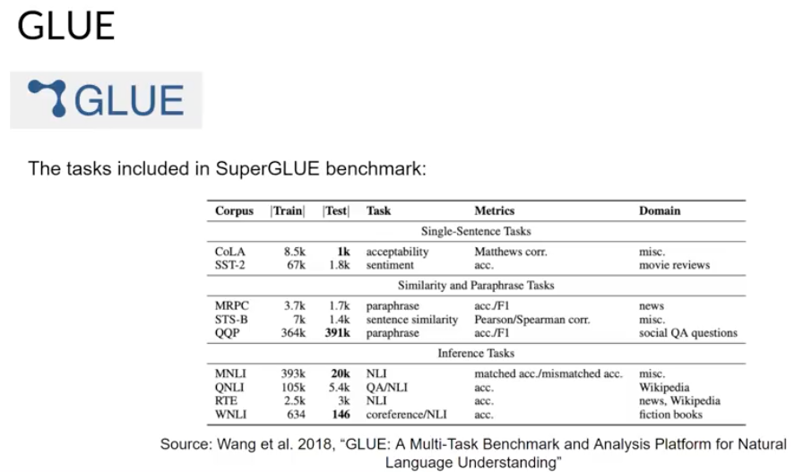
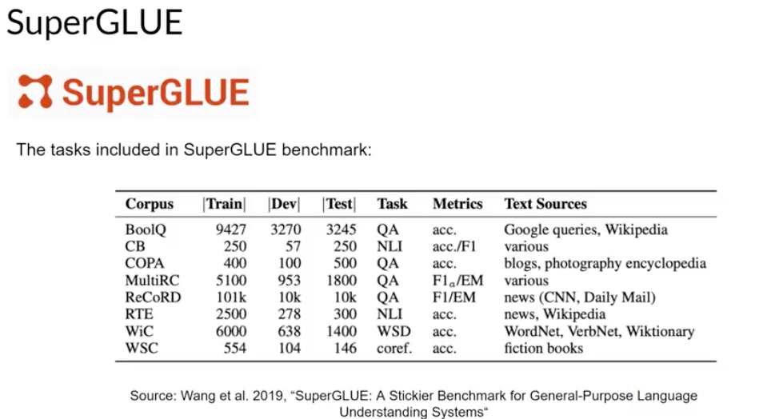
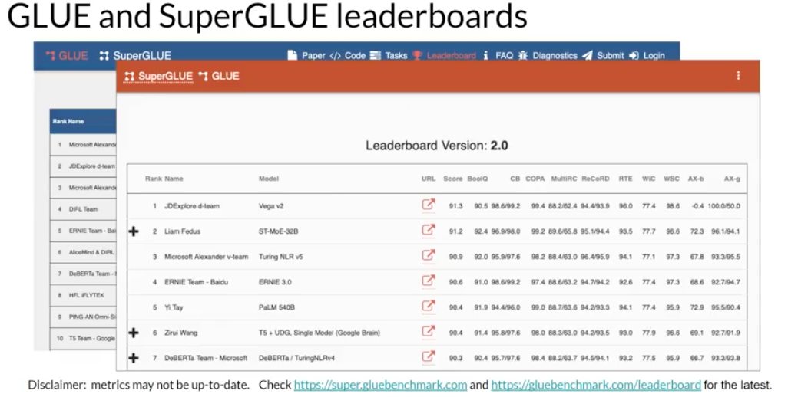
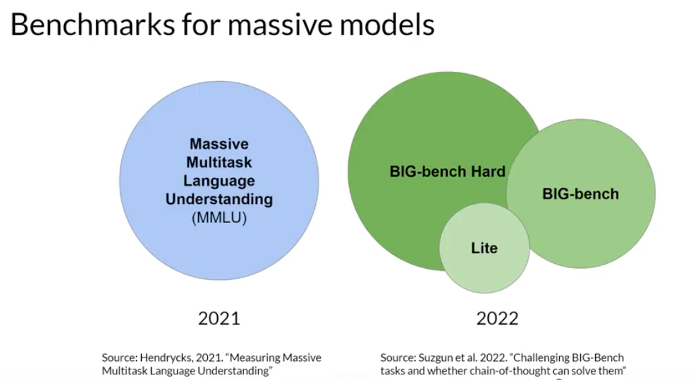
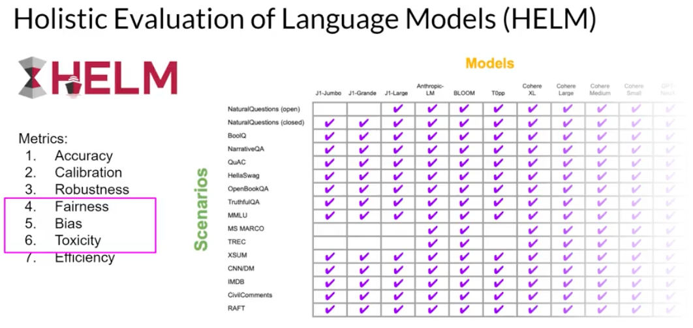

# Benchmarks

LLMs are complex, and simple evaluation metrics like the rouge and blur scores, can only tell you so much about the capabilities of your model. 
In order to measure and compare LLMs more holistically, you can make use of pre-existing datasets, and associated benchmarks that have been established by LLM researchers specifically for this purpose.

Selecting the right evaluation dataset is vital, so that you can accurately assess an LLM's performance, and understand its true capabilities. 
You'll find it useful to select datasets that isolate specific model skills, like reasoning or common sense knowledge, and those that focus on potential risks, such as disinformation or copyright infringement. 
An important issue that you should consider is whether the model has seen your evaluation data during training. 
You'll get a more accurate and useful sense of the model's capabilities by evaluating its performance on data that it hasn't seen before. 
Benchmarks, such as GLUE, SuperGLUE, or Helm, cover a wide range of tasks and scenarios. 

## GLUE

GLUE, or General Language Understanding Evaluation, was introduced in 2018. GLUE is a collection of natural language tasks, such as sentiment analysis and question-answering. 
GLUE was created to encourage the development of models that can generalize across multiple tasks, and you can use the benchmark to measure and compare the model performance

## SuperGLUE

It consists of a series of tasks, some of which are not included in GLUE, and some of which are more challenging versions of the same tasks. SuperGLUE includes tasks such as multi-sentence reasoning, and reading comprehension.

Leader board compare and contrast evaluated models.

https://super.gluebenchmark.com/leaderboard

## MMLM

Massive Multitask Language Understanding, or MMLU, is designed specifically for modern LLMs.
To perform well models must possess extensive world knowledge and problem-solving ability. Models are tested on elementary mathematics, US history, computer science, law, and more. In other words, tasks that extend way beyond basic language understanding

## Big Bench

BIG-bench currently consists of 204 tasks, ranging through linguistics, childhood development, math, common sense reasoning, biology, physics, social bias, software development and more. BIG-bench comes in three different sizes, and part of the reason for this is to keep costs achievable, as running these large benchmarks can incur large inference costs

## HELM

Holistic Evaluation of Language Models

The HELM framework aims to improve the transparency of models, and to offer guidance on which models perform well for specific tasks. 

HELM takes a multimetric approach, measuring seven metrics across 16 core scenarios, ensuring that trade-offs between models and metrics are clearly exposed. One important feature of HELM is that it assesses on metrics beyond basic accuracy measures, like precision of the F1 score. The benchmark also includes metrics for fairness, bias, and toxicity, which are becoming increasingly important to assess as LLMs become more capable of human-like language generation, and in turn of exhibiting potentially harmful behavior. HELM is a living benchmark that aims to continuously evolve with the addition of new scenarios, metrics, and models. You can take a look at the results page to browse the LLMs that have been evaluated, and review scores that are pertinent to your project's needs. 

