# Evaluation

## Challenges

How to formalize the improvement in the performance of a fine-tuned model?

accuracy = correct predictions / total predictions

problem is LLM outputs are non-deterministic

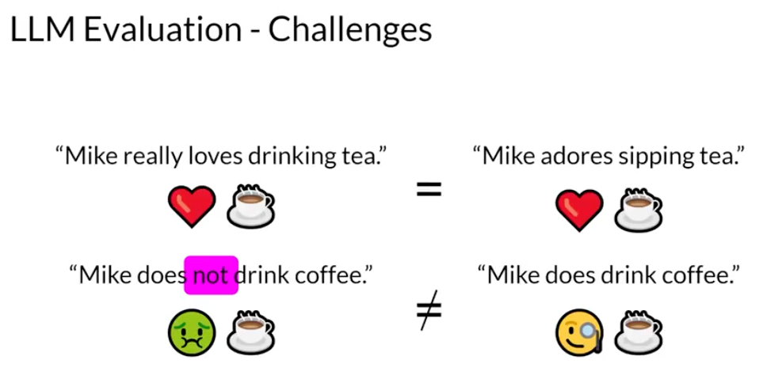

Take, for example, the sentence, Mike really loves drinking tea. This is quite similar to Mike adores sipping tea. 
But how do you measure the similarity? 

Let's look at these other two sentences. Mike does not drink coffee, and Mike does drink coffee. 
There is only one word difference between these two sentences. However, the meaning is completely different. 

humans can see the similarities and differences. But when you train a model on millions of sentences, you need an automated, structured way to make measurements.

## LLM Evaluation Metrics

### Metrics Terminology

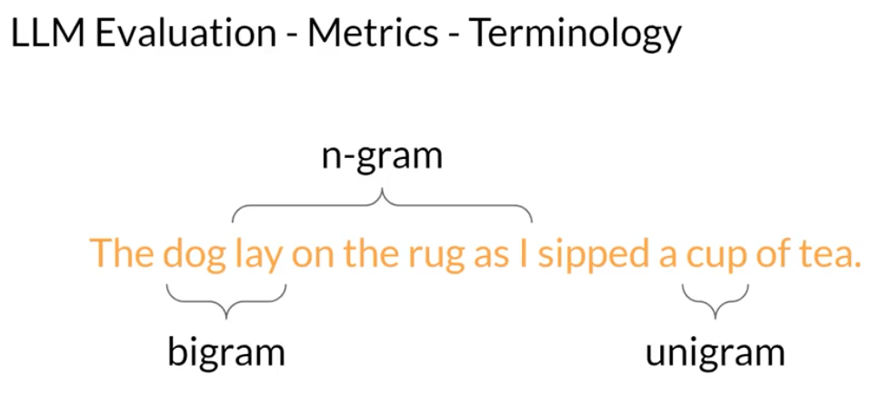

- unigram: one word
- bigram: two words
- n-gram: N words

### Metrics Methods

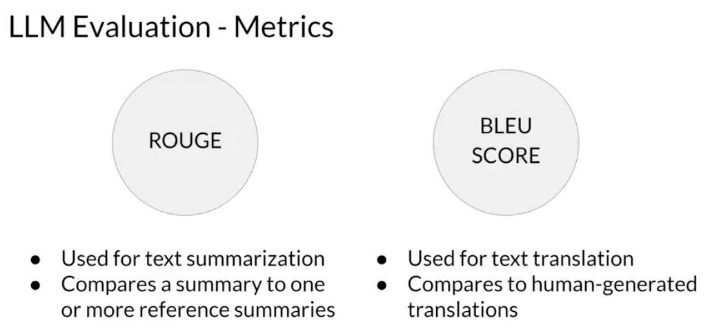

### ROUGE

#### ROUGE-1

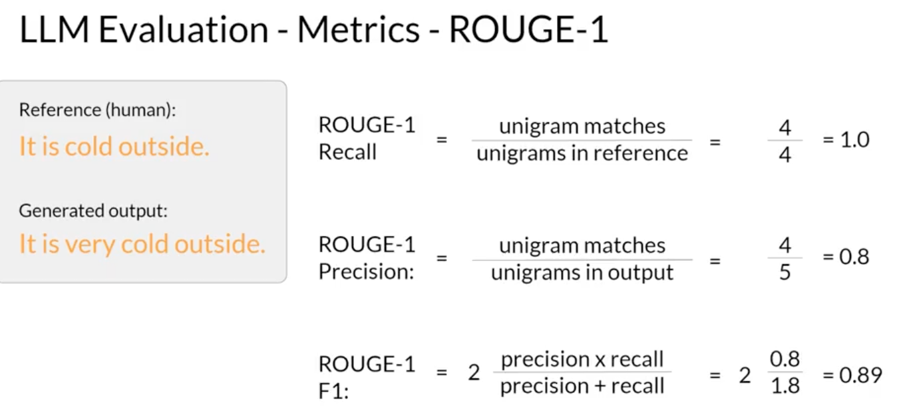

this approach can be misleading, for example.

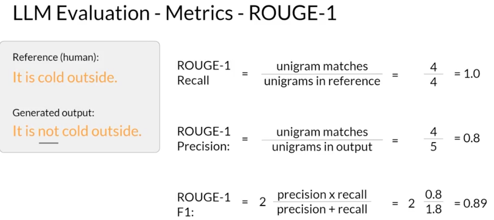

score is same but the meaning is completely different due to "not"

##### Clipping

There is a chance same word repeated multiple times and the unigram count can result is wrong.  Use clip to avoid duplicates.

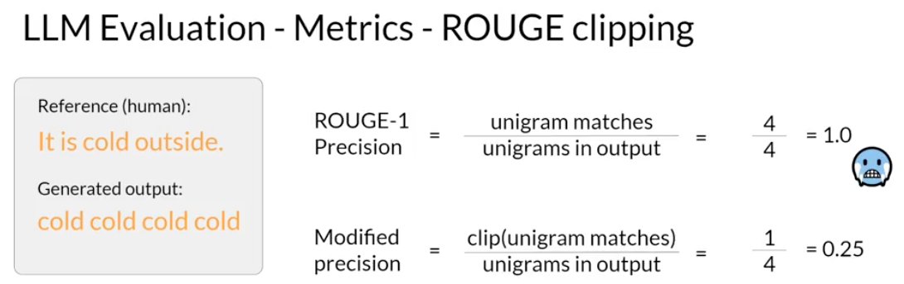

#### ROUGE-2

collection of two words at a time from the reference and generated sentence.

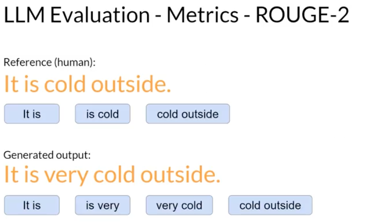

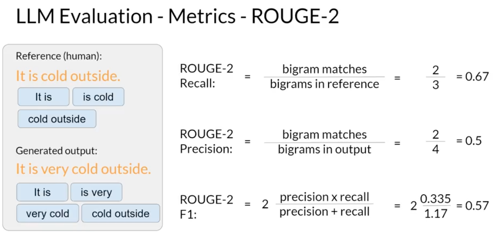

the scores are lower in the approach.

with longer sentence they are a greater chance that bigrams don't match and scores may be even lower.

instead of going rogue-3, rogue-4 lets take better approach rogue-L

#### ROUGE-L

The longest common subsequence present in the both generated output and the reference.

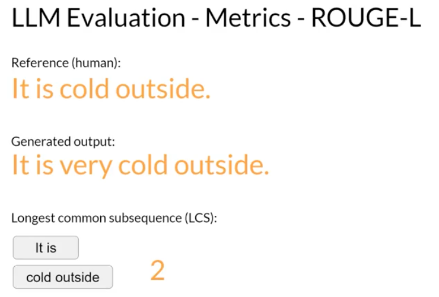

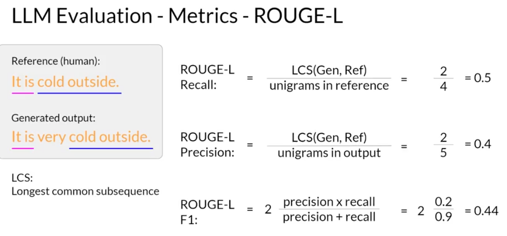

### BLUE Score

Bilingual evaluation under study.

Evaluates the quality of the machine translated text.

Calculated for a range of n-gram sizes and then averaged.

How many n-gram in the machine generated translation match those in the reference translation.
To calculate the score, you average precision across a range of different n-gram sizes

Calculating the BLEU score is easy with pre-written libraries from providers like Hugging Face.

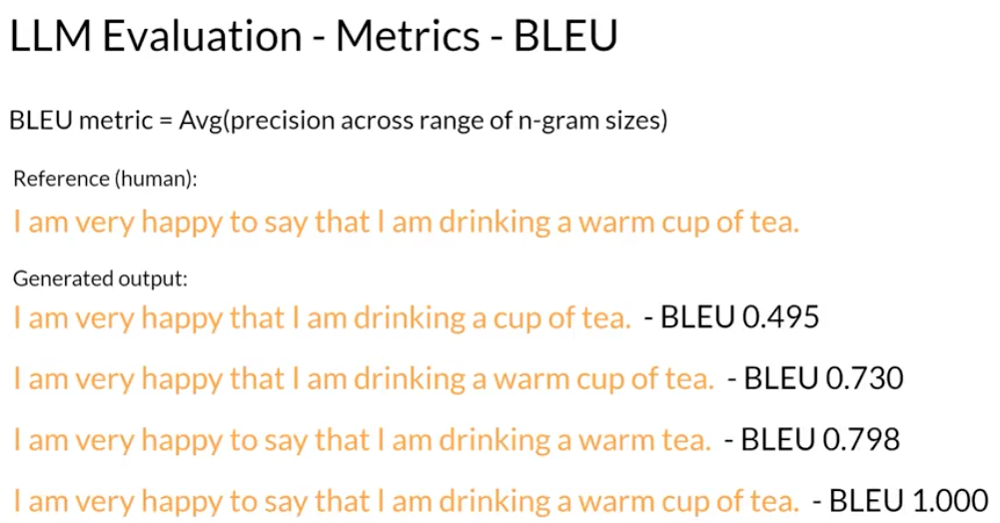

