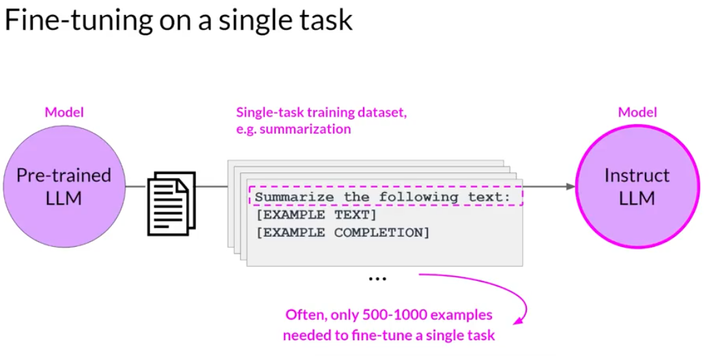
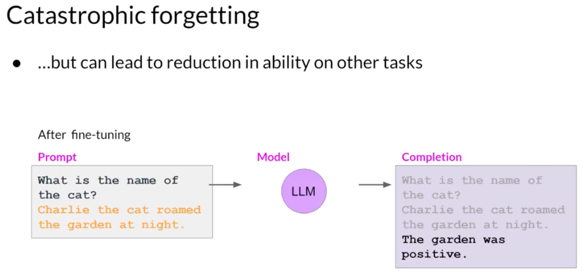

# Fine-Tuning

LLMs are pretrained and LLMs predicts the next word one at a time.

## PreTraining

Example:

My favorite food is bagel with cream cheese

    Input (A)                               | Output (B)
    My favorite food is a                   | bagel
    My favorite food is a bagel             | with
    My favorite food is a bagel with        | cream
    My favorite food is a bagel with cream  | cheese

Learns from 100Bs of words.

## Fine-Tuning

Use the specific known words to train the pretrained LLM.

- What a wonderful chocolate cake
- The novel was thrilling

Learns from 1000s of words

## Why fine-tune?

- Summarize in certain style or structure.

General LLM summarize the conversation in general way.  But a call center conversation may need specifics like customer id, system spec, os, version etc.

- Mimicking as specific person or character

Every person or character have unique way to addressing everyone, specific way of speaking habit.

- Translate medical notes

Medical notes are usually written in specific way only medical reps can understand.

- Legal Documents

### Why not build a model and why fine-tune?

#### Large models

To get a model perform a task may need 100B+ parameters, it requires large system to build.

#### Small models

Smaller models like 1B parameter can run in laptop or mobile.  But works for 100 to 500 examples only.

## Instruction Tuning

LLMs just not only predicts the next words, it follows the instruction.

    Prompt:  What is the capital of France?
    
    LLM can respond as:
    
    What is the capital of germany?
    
    Where is mumbai?

These are also possibility in the next word predictions.  All are list of questions.  

### Fine-Tuning:

Chat systems learns how to follow instruction during the fine-tuning.

    What is the capital of south korea?
    The capital of south korea is seoul.
    
    Help me brainstorm some fun museums to visit in SFO.
    Sure, here are some of the suggestions ....
    
    How to cheat in exam?
    I can't assist with it.

## Reinforcement Learning

Reinforcement learning from human feedback (RLHF).

Helpful, Honest, Harmless (HHH)

Step1: Train an answer quality (reward) model.  Human feedback scores for responses.

    Prompt:
    Advise me on how to apply for a job:

    Response                                            Score (Reward)
    --------------------------------------------------------------------
    I'm happy to help, here are some steps              5
    
    Just try your best.                                 2
    
    Its hopeless - why bother?                          1

Step2: Have LLM generate a lot of answers, Further train it to generate more responses that get high scores.

## Fine-tuning on single task

While LLMs have become famous for their ability to perform many different language tasks within a single model, your application may only need to perform a single task. In this case, you can fine-tune a pre-trained model to improve performance on only the task that is of interest to you.
For example, summarization using a dataset of examples for that task. Interestingly, good results can be achieved with relatively few examples. Often just 500-1,000 examples can result in good performance in contrast to the billions of pieces of texts that the model saw during pre-training.

### Catastrophic Forgetting

Catastrophic forgetting happens because the full fine-tuning process modifies the weights of the original LLM. While this leads to great performance on the single fine-tuning task, it can degrade performance on other tasks.

fine-tuned model for sentiment analysis may no longer carry out other tasks.

How to avoid this?

You can perform fine-tuning on multiple tasks at one time. Good multitask fine-tuning may require 50-100,000 examples across many tasks, and so will require more data and compute to train.

### PEFT

PEFT is a set of techniques that preserves the weights of the original LLM and trains only a small number of task-specific adapter layers and parameters. PEFT shows greater robustness to catastrophic forgetting since most of the pre-trained weights are left unchanged

