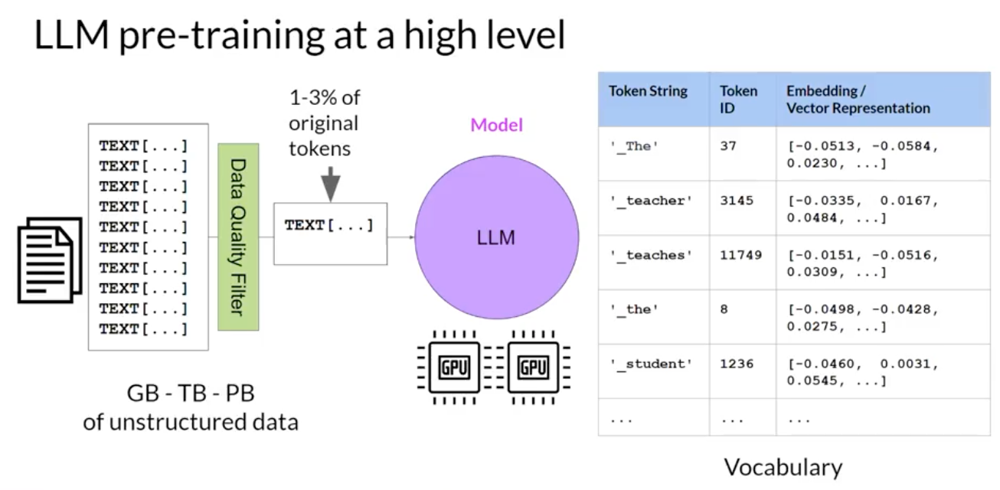
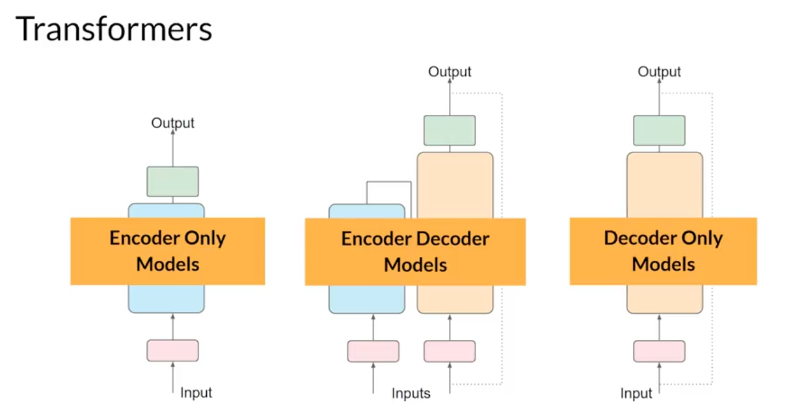
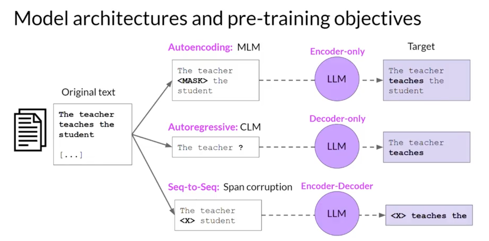
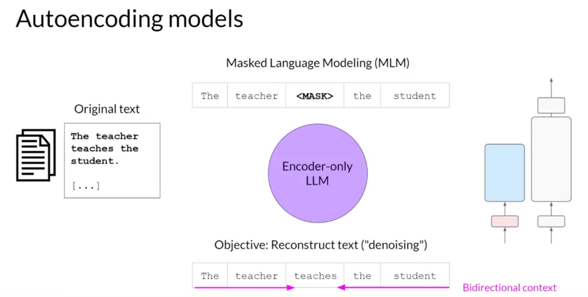
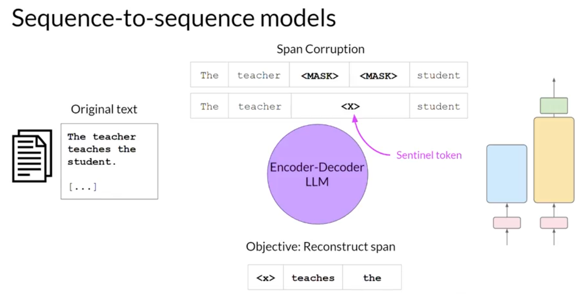
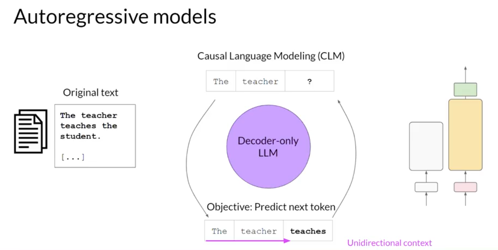
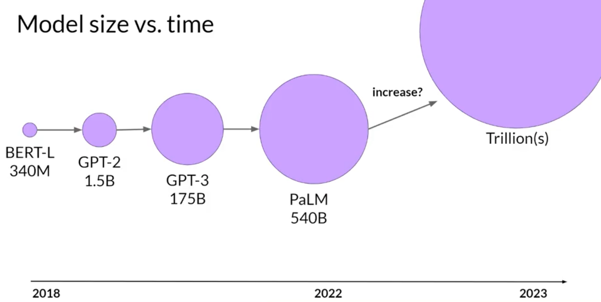

# Models

## Types of models

### Foundation Model (Pretrained)

Opensource provided by AI community.

### Train your own model (Custom)

## How models are trained

LLM Pre-training at high level.

## Transformer Models

Trained differently to carry out different tasks.

### Architecture

### Encoder only Models

Also knows as Autoencoding models are pretrained using masked language modeling (MLM).

Random strings are asked in a sentence and LLM's objective is to predict it.

Use cases:

- sentiment analysis
- named entity recognition
- word classification

Example models:

- BERT
- ROBERTA

### Encoder Decoder Models

Also known as sequence-to-sequence model uses both encoder and decoder.  The objective varies for models.

Populate T5 model's objective is span corruption.

Mask the random tokens (words) in the input sequence, and the masked tokens are replaced with sentinel token (special token added to vacoplury not correspond to any actual word in the input text).  Then the decoder tasked to reconstruct the span of token sequence in auto recursively. The output is the sentinel token followed by the predected token.

Use cases:

- translation
- text summarization
- question answering
- 
Example models:
- T5
- BART

### Decoder only Models

Also known as Autoregressive models are pretrained using causal language modeling (CLM).

The LLMs objective it to predict the next word (token) based on the previous context.  One prediction at a time and goes in a cycle in unidirectional context.

Use cases:

- text generation
- other emergent behavior

Example models:
- GPT
- BLOOM
- 
## Model size vs time

