# Compute

## CUDA

*Compute Unified Device Architecture* is a collection on libraries and tools developed for NVIDIA GPUs.

Libraries like pytorch, tensor flow use CUDA to boost the metrix multiplication and other operation related to deep learning.

## Challenges

ERROR: CUDA out of memory.

LLMs are huge and requires ton's of memory to store and train all of the parameters.

### GPU RAM to store 1B parameters

Basic RAM required for 1B is huge.  This is only for parameters.

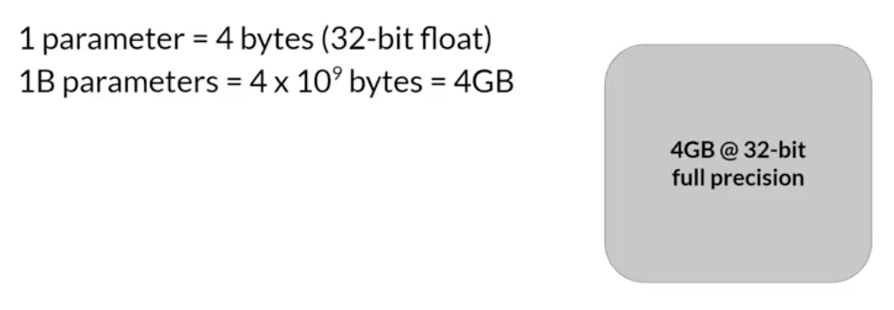

To train a model we need additional configures to feed it 20 extra bytes, it required additional memory .

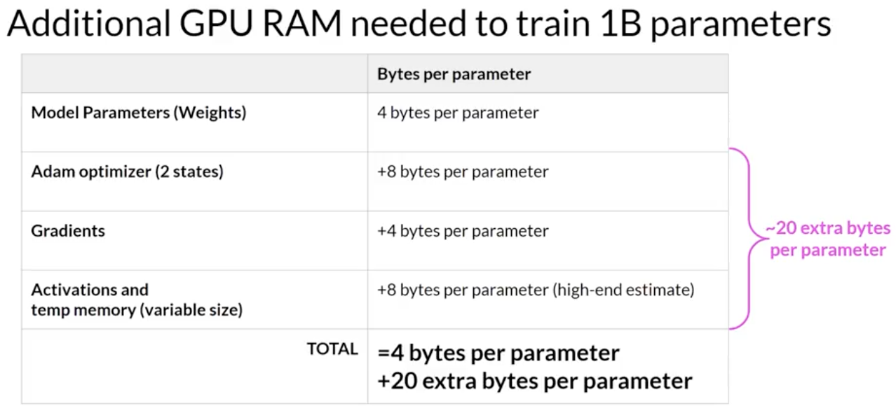

To get 1B training typically 6x of the memory required.

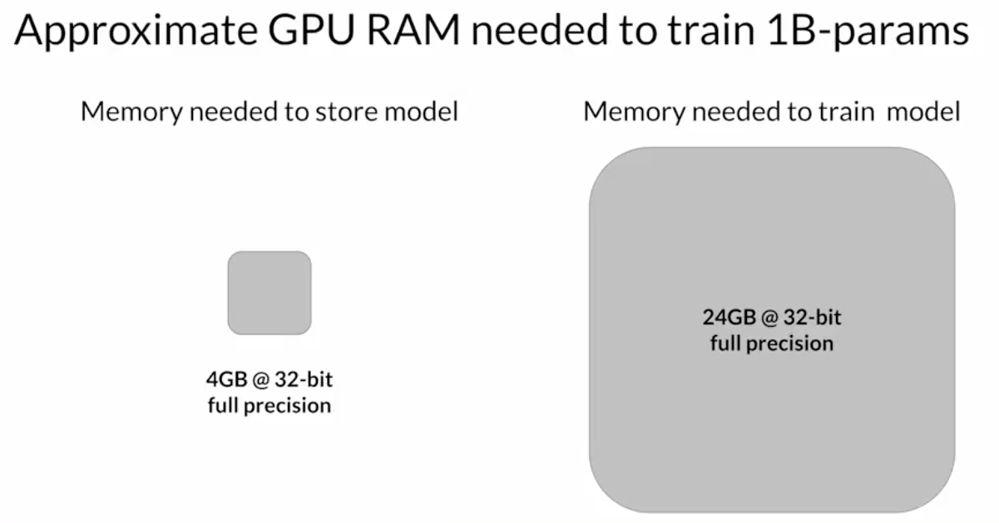

### Quantization

How to reduce the memory required for the training?

Store the 32 bit floating point numbers into lower precision spaces to reduce the memory.

- instead of using 32 bit to store floating point use 16 bit floating point or 8 bit integer
  - FP32: 32 bit floating point
  - FP16: 16 bit floating point
  - BFLOAT16: 16 bit floating point
  - INT8: 8 bit integer

Note: reducing the memory reduce the precision of the LLM response because we lose the floating precision.

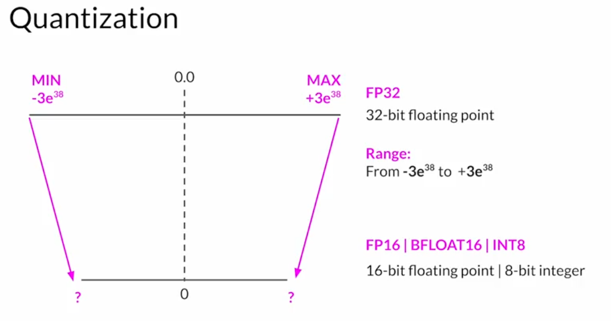

Example:  Store Pi value 3.141592

#### FP16

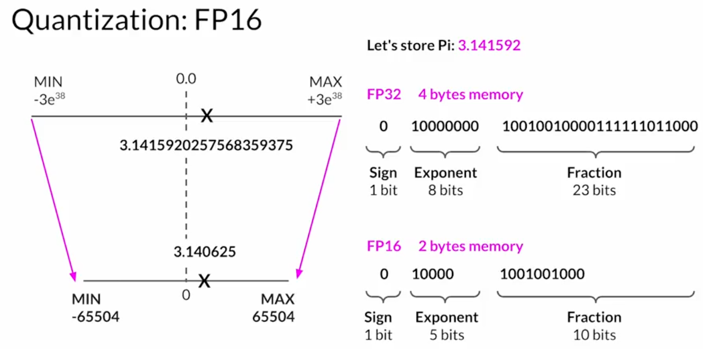

Note: sign bit 0 is positive, 1 is negative number.

#### BFLOAT16

BFLOAT16 is the popular alternative for FP16 and popular in deeplearning.Its in FLAN-T5 model and supported by NVIDIA gpus.

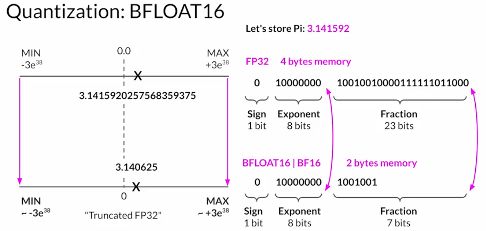

#### INT8

Reduces the memory but lose the precision.

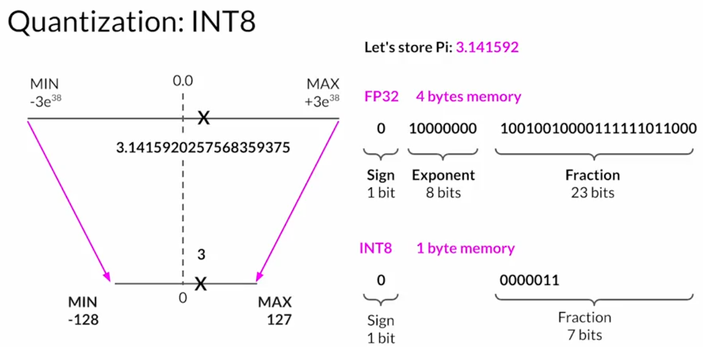

### LLM

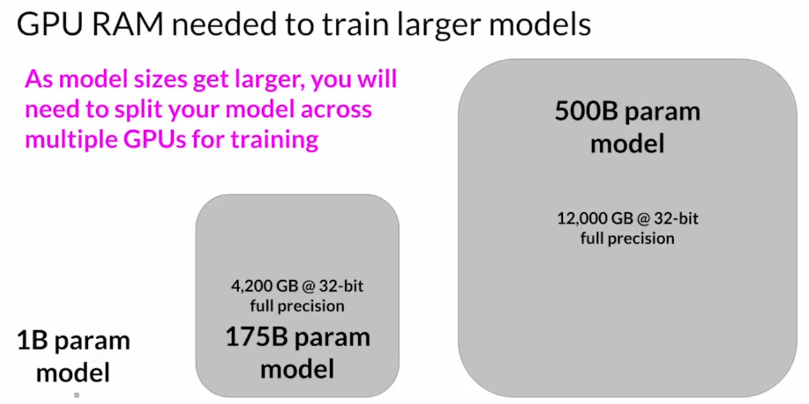

## Distribute the load

Models are too bit for single GPUs, even if model can fix in single gpu train data in parallel using multiple gpus to speed up the process.

Example:

Lets assume the model fits in a single GPU.  Use multiple gpu for fast training.

### Distribute data parallel (DDP)

distribute the large data set to multiple GPUs.

pytorch provides the DDP

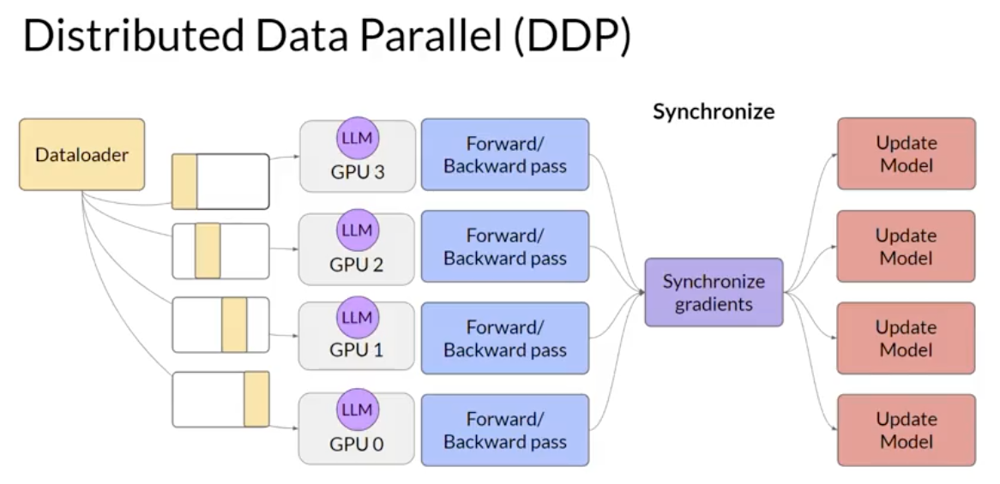

Memory usage:

usage by color code.

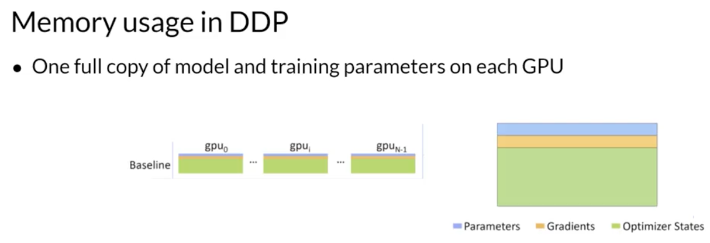

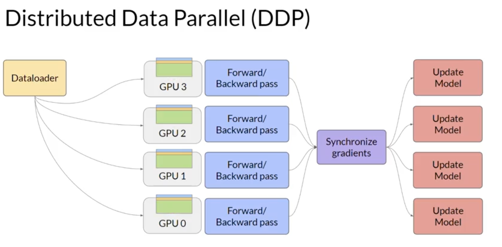

### Fully shared data parallel (FSDP)

ZeRO - zero data overlap between GPUs.

Its useful when the data does not fit in single GPU.

Optimize the memory by distributing the data between GPUs with zero data overlap.

memory usage:

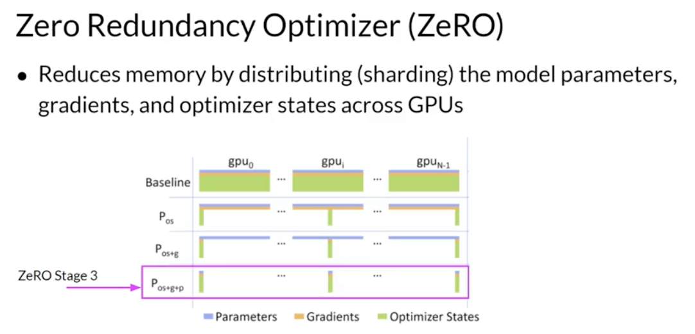

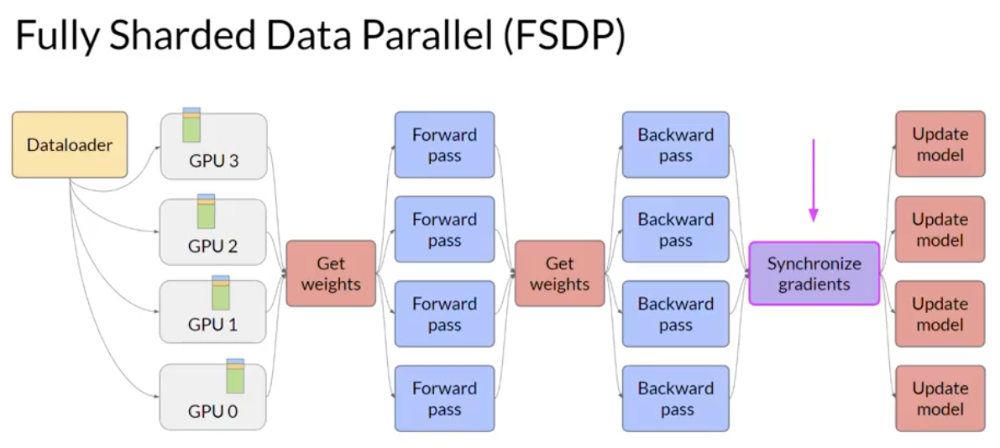

- Help to reduce overall gpu memory utilization
- supports offloading to cpu if needed

Performance & Memory utilization can be adjusted using sharding factor.

- Full replication (no sharding) (use 1 GPU)
- Full sharding (use max number of GPUs)
- Hybrid sharding (use half of the gpus)

## Impact

DDP and Full replication gives OOM error for anything beyond 2.28B.

Fully sharding and Hybrid sharding out performed.

Also increasing the GPU count result is high response.

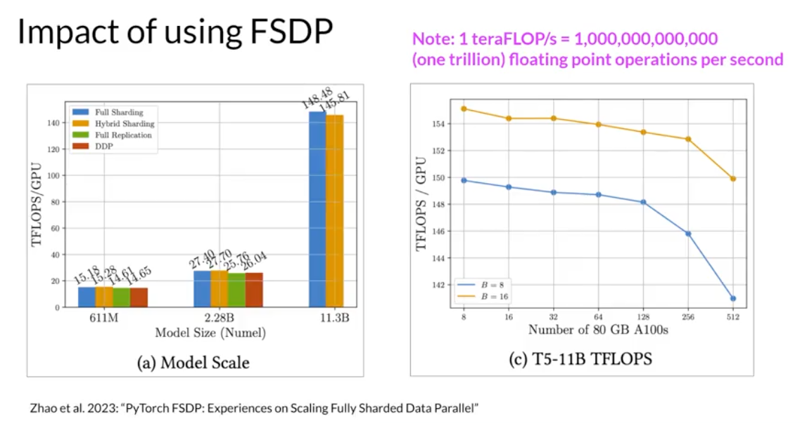

## Scaling laws

Goal: maximize model performance

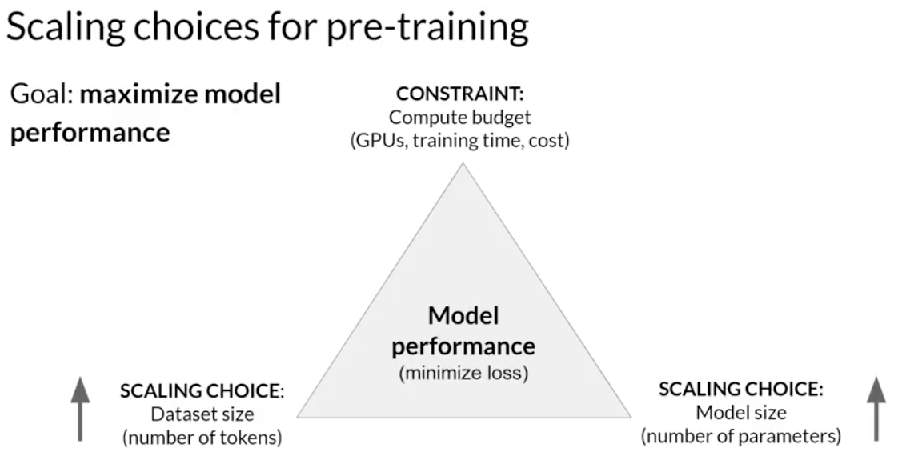

The performance is controlled by 3 aspects.

- Dataset size
- Model size
- Compute budget

Note:

- Increasing any factor will result in the model performance improvement.
- Decrease in any factor will result is model performance degrade.

## Compute budget

1 Petaflop/s : 1 quadrillion floating point operations per second (1,000,000,000,000,000)
1 Petaflop/s-day: # floating point operations performed at rate of 1 petaFLOP per second one day

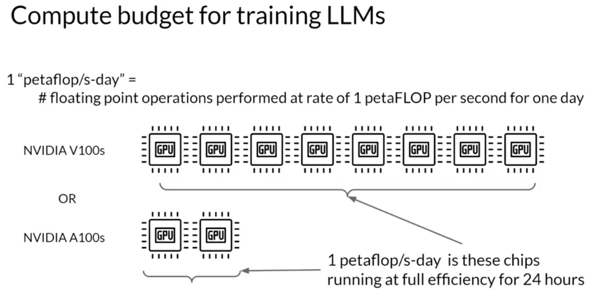

Huge compute required to train LLMs.

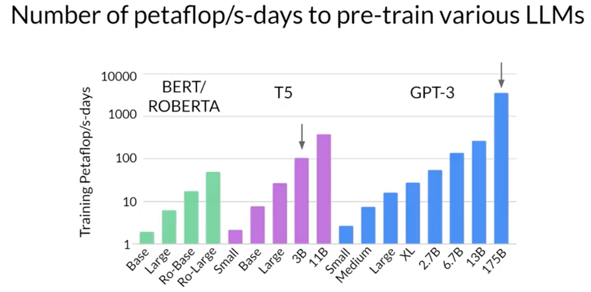

## Optimal Number

### chinchilla paper

After the analysis the paper points out many llms are over parameterized and under trained.

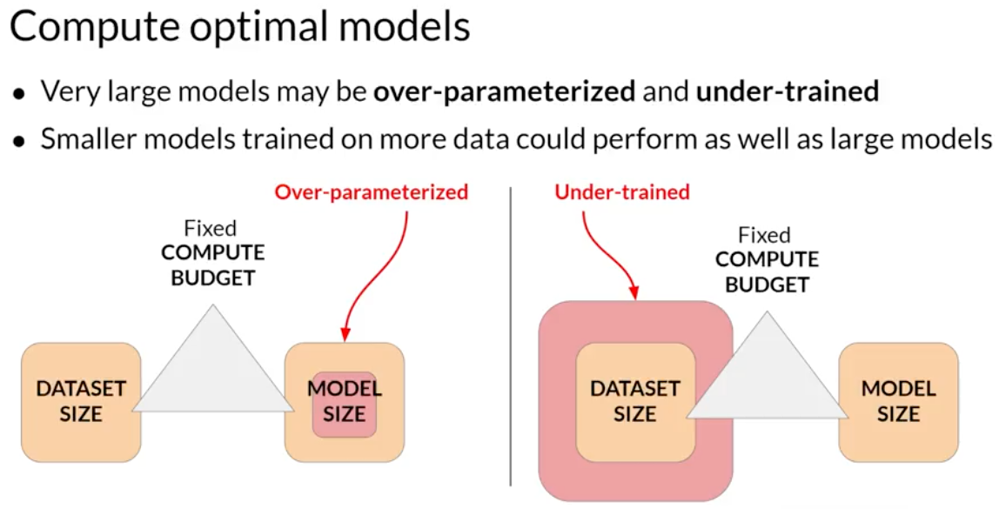

Chinchilla model is the optimal number.  Compute # of token must be ~20x of # of parameters.  

By this study, GPT-3, OPT, BLOOM are under-trained.

Result: compute chinchilla model out-performed the non-compute models (GPT) on large range of down stream tasks. 

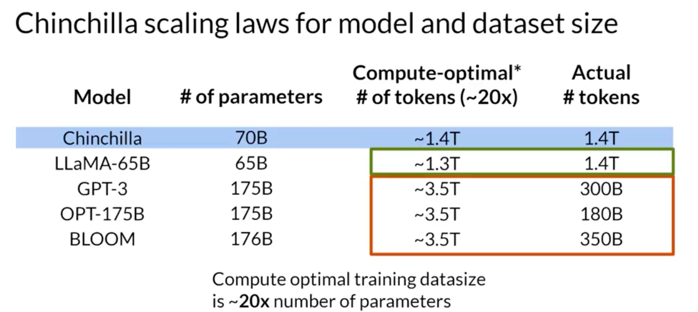

Future trend?

Instead of bigger the better (increasing the parameters), smaller models can provide better performances.

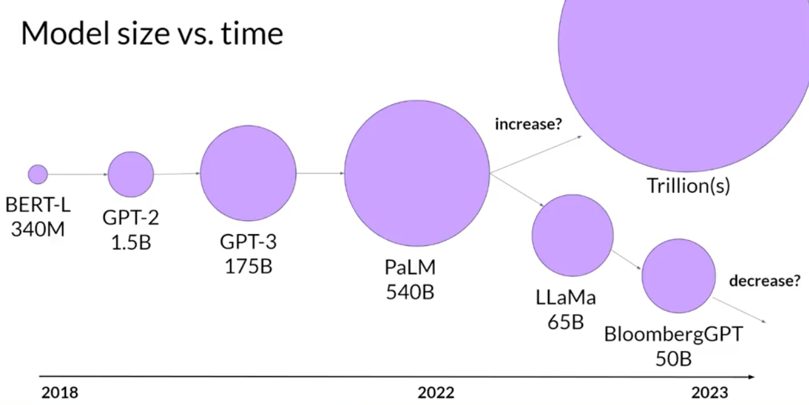